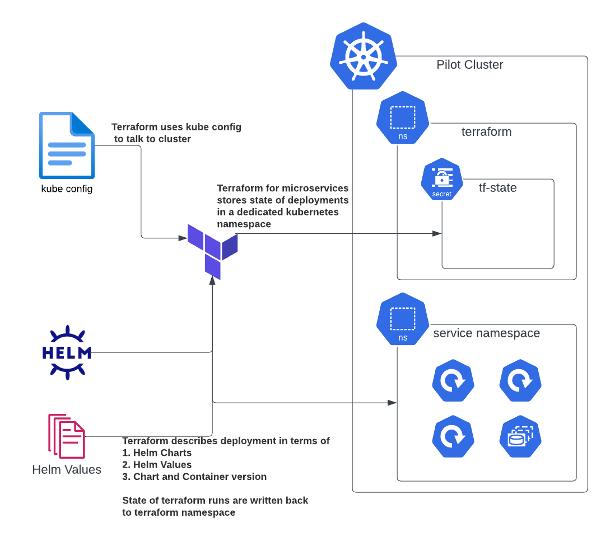

# DevOps

Commong DevOps practices and technologies of Pilot regardless of host infrastructure. 

## Infra Repository
Every pilot deployment will have an accompanying infrastructure respository where all of the Infrastructure-as-Code (IaC) and configuration management to bootstrap a deployment of Pilot. 

Each layer of the deployment should be decoupled in a way allowing for updating of each layer independantly of the other. For example if kubespray was used to deploy Kubernetes, the terraform for deploying the Pilot microservices should be able to be run without triggering the Kubespray resources. 

### Microservices Terraform 
Inside the infrastructure repostory there will be a directory containing the terraform resources for deploying and managing the Pilot microservices in the form of Helm Charts.

