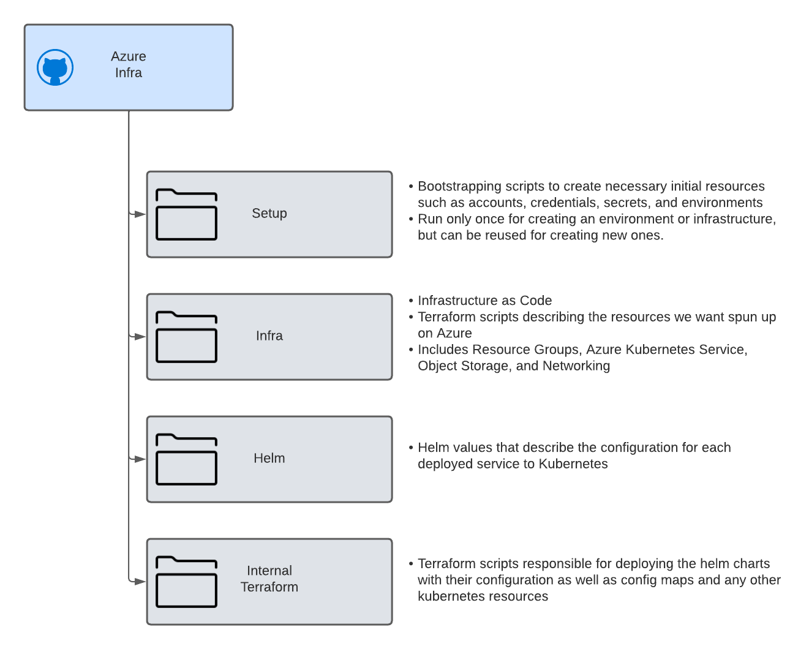

# DevOps

Commong DevOps practices and technologies of Pilot regardless of host infrastructure. 

## Infra Repository
Every pilot deployment will have an accompanying infrastructure respository where all of the Infrastructure-as-Code (IaC) and configuration management to bootstrap a deployment of Pilot. 



Each layer of the deployment should be decoupled in a way allowing for updating of each layer independantly of the other. For example if kubespray was used to deploy Kubernetes, the terraform for deploying the Pilot microservices should be able to be run without triggering the Kubespray resources. 

### Microservices Terraform 
Inside the infrastructure repostory there will be a directory containing the terraform resources for deploying and managing the Pilot microservices in the form of Helm Charts.

To ensure we have a stable target to record terraform state, regadless of what infrastructure Pilot is deployed to, we store the terraform state of the services directly in Kubernetes.


If a CI/CD tool running within the Kubernetes cluster is used to run the terraform, a kube config file will not be necessary, and appropriate cluster roles can be setup such that the running terraform pod gets its config from the environment. 

Where possible, the directory containing the microservice terraform should include a `run.sh` to ease in both running the terraform manually, and to aid in automation. The script should be able to be invoked as follows:
```bash
./run.sh <env_name> 
# where env_name describes the environment if using terraform to manage a multi-environment deployment (dev/qa/staging/prod as an example)
```
